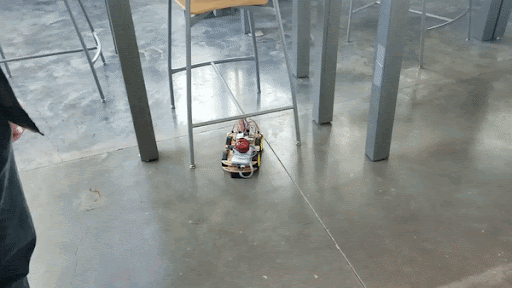
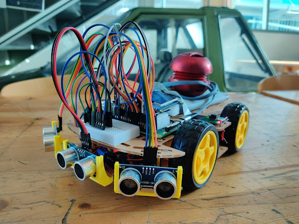
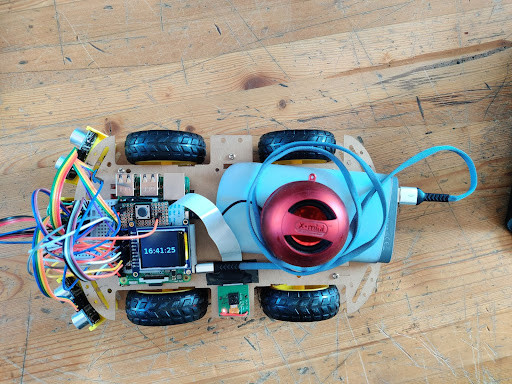
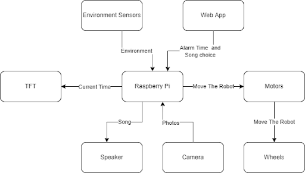
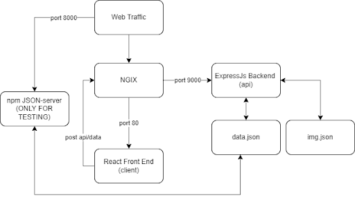
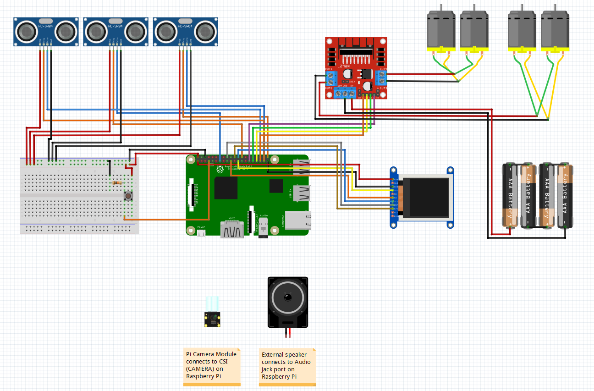

# Alarm Clock Chaser 

### CPEN291 Project - 2021W Term 2 

Group Members: Julian Wong, Justin Ng, Tayyib Chohan, Sam Dai 

# Project Overview

A Lot of people have trouble getting out of bed in the morning and if you claim that you do not immediately snooze or dismiss your alarm, then lay in your bed and contemplate getting out of bed, you are a liar. 
Our solution is an alarm clock that drives away from you. At night you can set your alarm from the comfort of your bed but in the morning you are forced to get up and chase down the alarm clock ensuring you get out of bed to start your day. 

The alarm can be set through the web server interface, which allows for a time and song choice setting to be sent to the device. Once it's time for the alarm to ring, the chosen song begins playing and the pathing algorithm will intiiate, causing the alarm device to begin driving away and avoiding any obstacles in it's path. When the robot has finally been caught, deactivating it can be done by pressing the button on the top of the chassis. Once pressed, all movement and audio will stop, and the camera that is attached to the Raspberry Pi will take a picture of the user, and upload this image to Imgur, a media sharing website. A url containing the image will be sent back to the web server to be viewed. 

# Component List

| Part                       | Description                                              | Quantity |
| -------------------------- | -------------------------------------------------------- | -------- | 
| Raspberry Pi Model 3 B+    | Primary computing device for alarm functionality         | 1        | 
| HC-SR04                    | Ultrasonic sensor for proximity detection                | 3        | 
| Pi Camera Rev 1.3          | RPI camera module                                        | 1        | 
| L298N2                     | DC motor drive controller                                | 1        | 
| Push Button                | Alarm deactivation sequence                              | 1        | 
| Adafruit 1.8'' TFT Display | LCD display for the current time                         | 1        |
| Breadboard                 | Solderless connections for the HC-SR04                   | 1        |
| Proto Board                | Soldered connections for the TFT display and push button | 1        | 
| Acrylic Car Chassis        | Main body of the robot                                   | 1        | 
| X-Mini Speaker             | Audio output for the alarm sound                         | 1        | 
| Power Bank                 | Power supply for the Raspberry Pi                        | 1        | 
| 1.5V AA Battery            | Power supply for DC motors                               | 4        |
| 10kOhm Resistor            | Pull down resistor circuit                               | 1        |

# Robot Chassis

# Block Diagrams 

 
 

# Fritizing Diagram

